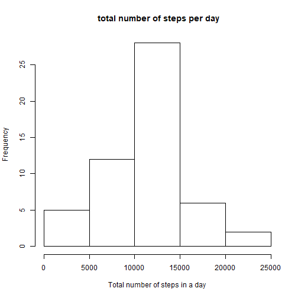
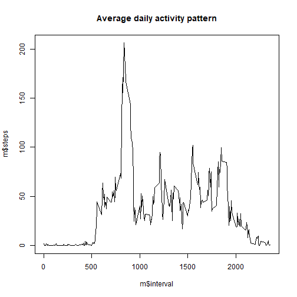
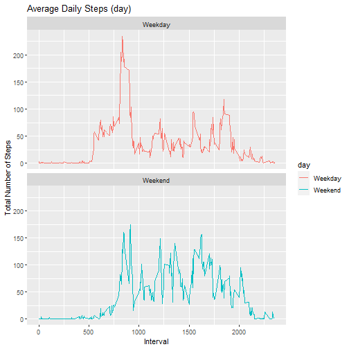

## Loading and preprocessing the data

```
## 
## Attaching package: 'dplyr'
```

```
## The following objects are masked from 'package:stats':
## 
##     filter, lag
```

```
## The following objects are masked from 'package:base':
## 
##     intersect, setdiff, setequal, union
```


## What is mean total number of steps taken per day?

```r
x<-group_by(data,date)
y<-summarise(x,total=sum(steps))
```

```
## `summarise()` ungrouping output (override with `.groups` argument)
```

```r
hist(y$total, main=" total number of steps per day", 
     xlab="Total number of steps in a day")
```




## What is the average daily activity pattern?

```r
m<-aggregate(steps~interval,data,mean)
plot(m$interval,m$steps,type="l",main="Average daily activity pattern")
```




## Imputing missing values

```r
s<-sum(is.na(data1))

data2<-data1
data2[is.na(data$steps)]<-mean(data2$steps,na.rm=TRUE)
m1<-aggregate(steps~date,data2,sum)

hist(m1$steps, main=" total number of steps per day", 
     xlab="Total number of steps in a day")
```


```r
summary(m1)
```

```
##          date        steps      
##  2012-10-02: 1   Min.   :   41  
##  2012-10-03: 1   1st Qu.: 8841  
##  2012-10-04: 1   Median :10765  
##  2012-10-05: 1   Mean   :10766  
##  2012-10-06: 1   3rd Qu.:13294  
##  2012-10-07: 1   Max.   :21194  
##  (Other)   :47
```
## Are there differences in activity patterns between weekdays and weekends?

```r
data2['day']<-weekdays(as.Date(data2$date))
data2$day[data2$day %in% c("Saturday","Sunday")]<-"Weekend"
data2$day[data2$day!="Weekend"]<-"Weekday"
data2$day<-as.factor(data2$day)
d<-aggregate(steps~interval+day,data2,mean)
par(mfrow=c(1,2) ,mar=c(4,2,2,1))

ggplot(d, aes(x =interval , y=steps, color=day)) +
  geom_line() +
  labs(title = "Average Daily Steps (day)", x = "Interval", y = "Total Number of Steps") +
  facet_wrap(~ day, ncol = 1, nrow=2)
```



